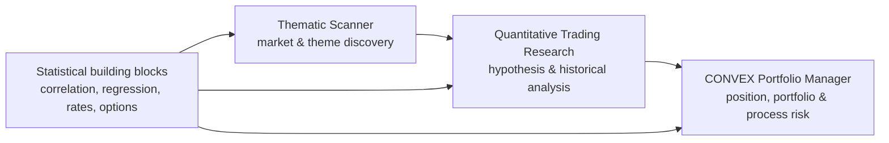

# Patrick Rychter | Quantitative Research & Analytical Systems

  
  

I build Excel-first quantitative research tools for **portfolio risk, options analysis, thematic screening, macro research, statistical relationships, and trading-process review**.

My background is in project management, homebuilding and real-estate investment. Over the last several years I have independently developed analytical systems that combine market data, option theory, econometrics, technical research and structured decision processes. This page is the central index for the projects and research I am making public.

## Start here — featured projects

| Project | What it does | Current public version |
|---|---|---|
| **[CONVEX Portfolio Manager](https://github.com/PatrickRych/Convex-Portfolio-Manager)** | Options portfolio and trade-management system covering leg-level Greeks, position analytics, portfolio exposures, scenario analysis, risk limits and closed-trade review. | Synthetic $100k Excel demo, operating guide, architecture/methodology documentation and a separate 2026 journal-derived performance review. |
| **[Thematic Scanner](https://github.com/PatrickRych/Thematic-Scanner-)** | Excel-based thematic equity and ETF screener that combines curated research boards with trend, ATR extension, momentum, volume and screening controls. | Documentation published; revised 150-block workbook is still being independently validated before a public demo is released. |
| **[Quantitative Trading Research](https://github.com/PatrickRych/Quantitative-Trading-Research-)** | Research library for market-regime models, options behavior, calendar effects and cross-asset studies. | Research index and illustrated study/model notes published; source results are clearly separated from independently replicated findings. |
| **[Volatility Positioning Map](https://github.com/PatrickRych/Volatility-Positioning-Map)** | Cross-sectional volatility dashboard combining IV, realized volatility, skew, volatility risk premium, ATR-normalized trend extension, volume scoring and a regime filter across 25 liquid ETFs/ETPs. | Documentation and model screenshots; public demo workbook pending data/vendor sanitization. |

## How the portfolio fits together

The projects are meant to show a full analytical workflow: **organize the opportunity set → test relationships and hypotheses → understand option/market structure → size and monitor portfolio risk → review realized decisions and improve the process**.

## Analytical building blocks

| Repository | Focus | What it demonstrates |
|---|---|---|
| **[Covariance & Correlation Matrix](https://github.com/PatrickRych/Covariance-Correlation-Matrix-)** | Cross-asset covariance, rolling correlation and beta | Relationship monitoring, diversification analysis, hedge effectiveness and structural-break awareness. |
| **[Regression Tool](https://github.com/PatrickRych/Regression-Tool)** | Beta, correlation, R² and regression diagnostics | Systematic-versus-idiosyncratic decomposition, rolling relationships and beta-based hedge sizing. |
| **[U.S. Rate Dynamic Model](https://github.com/PatrickRych/Rate-Dynamic-Model)** | Treasury yield-curve and macro overlay | Term-structure shifts, curve inversion/steepening, monetary-policy context and rate-regime monitoring. |
| **[Options Pricing Models](https://github.com/PatrickRych/RRG-Visualizer)** | Black-Scholes and option-price simulation | Option valuation, sensitivity to spot/volatility/time, payoff comparison and implied-versus-realized context. |
| **[Macro Factor Analysis](https://github.com/PatrickRych/Macro-Factor-Analysis)** | Macro-factor research workspace | Early-stage repository; public documentation is still being built. |
| **[Backtesting Engine](https://github.com/PatrickRych/Backtesting-Engine)** | Strategy-testing framework | Early-stage repository; public documentation is still being built. |

## What I am trying to demonstrate

Across these repositories, the emphasis is on applied analytical work rather than isolated spreadsheets:

- translating discretionary research questions into structured models;
- connecting transaction-level data to position- and portfolio-level risk;
- using beta, correlation, regression, volatility and option Greeks in practical workflows;
- building transparent Excel systems with auditable formulas and clear assumptions;
- separating exploratory findings from validated evidence;
- documenting limitations, data-quality risks and publication caveats;
- turning historical results into specific process-improvement questions.

## Current flagship work

### CONVEX — portfolio risk + trading-process feedback

CONVEX is the most complete system in the portfolio. The public repository includes a synthetic demonstration workbook and operating guide, while the new **2026 Trading Performance Review** shows how the journal feeds back into the process through profit factor, R-multiples, setup attribution, drawdown analysis and loss-tail diagnostics.

**[Open CONVEX →](https://github.com/PatrickRych/Convex-Portfolio-Manager)**

### Thematic Scanner — discovery and filtering

The scanner organizes a large thematic universe into boards and groups, then compares securities using price-history-derived technical measures. It is intended to narrow a research universe, not generate automatic trade recommendations.

**[Open Thematic Scanner →](https://github.com/PatrickRych/Thematic-Scanner-)**

### Volatility Positioning Map — cross-sectional volatility context

This model compares implied volatility, realized volatility, skew, volatility risk premium and trend/extension across a 25-ETF universe. Three scatter maps make it easier to see where option pricing and realized conditions sit relative to each other, while a fixed-strike tracker separates true IV repricing from simple movement along the smile.

**[Open Volatility Positioning Map →](https://github.com/PatrickRych/Volatility-Positioning-Map)**

### Quantitative Trading Research — studies and model reports

This repository is the publication layer for independent research. It currently includes event-study work and documented model research covering options expiration, stock/bond calendar behavior, macro regimes and single-ticker quantitative analysis.

**[Open Quantitative Trading Research →](https://github.com/PatrickRych/Quantitative-Trading-Research-)**

## Development direction

The next stage is to move selected spreadsheet engines into reproducible code where testing, version control and point-in-time data handling are easier. The Excel models remain useful because they make the full calculation chain visible; Python is the natural next layer for repeatability and larger-scale validation.

---

**Portfolio note:** These are self-directed analytical projects. Public demo data and historical research are labeled according to their source and verification status. Nothing here is investment advice, audited performance or institutional production infrastructure.
